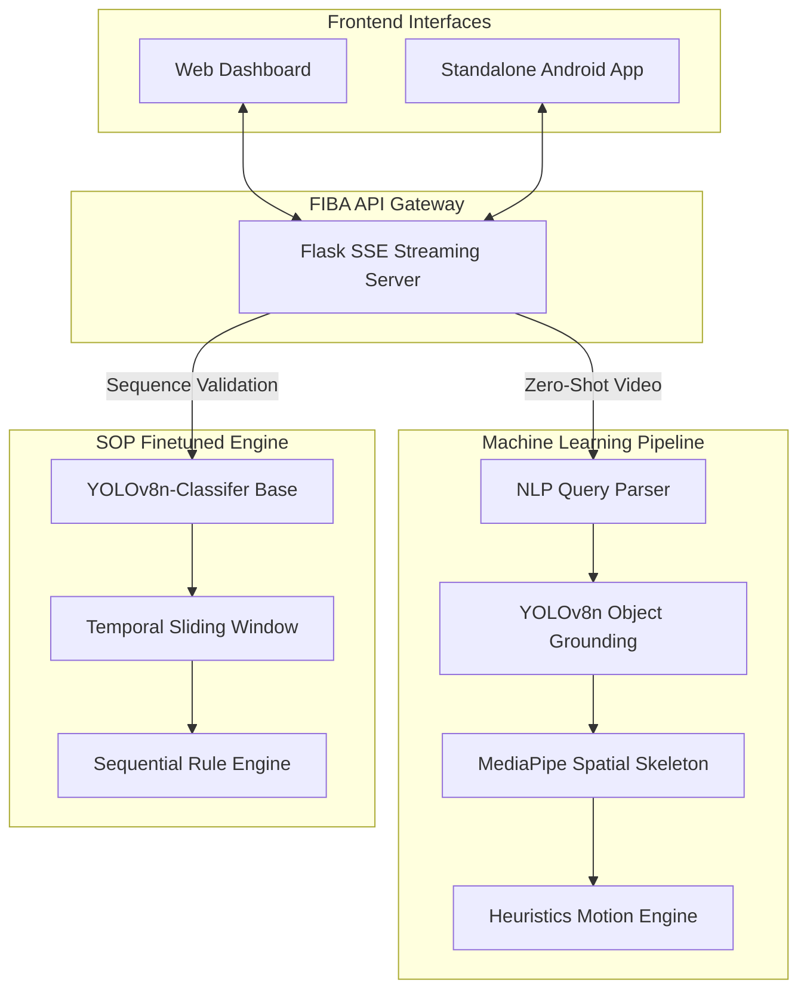
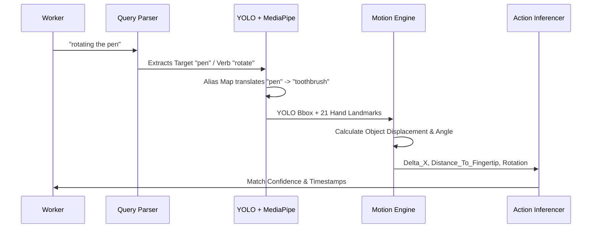
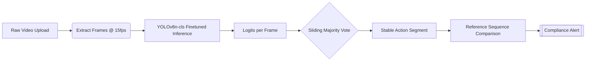

# 🏭 FIBA AI — Find it by Action
> **Edge-Ready · Zero-Shot Action Recognition · Explainable AI · SOP Compliance Validation**
> 
> *Developed for the MIT Bangalore × Hitachi Hackathon*

---

## 📖 Project Overview

FIBA AI is an advanced, locally-deployed computer vision platform designed specifically for the manufacturing and assembly line environment. Modern factories suffer from manual QC processes and inability to search surveillance footage contextually. FIBA AI solves this by introducing two interconnected pipelines:

1. **Zero-Shot Action Search Engine:** Search factory footage using natural language (e.g., *"Placing the white plastic part"*) to instantly retrieve exact timestamps and evidence frames of complex spatial interactions.
2. **SOP Compliance Validator:** A highly fine-tuned neural network that sequences multi-step assembly actions, strictly flagging errors, missed steps, or out-of-order procedures on the assembly line.

---

## 🏗️ System Architecture

The ecosystem relies on an asynchronous Flask backend communicating strictly offline to preserve industrial data privacy. 



---

## 🔬 Methodology Part 1: Zero-Shot Action Pipeline

Unlike black-box video foundation models, FIBA AI uses a highly interpretable, physics-based approach to decipher actions. This ensures zero latency and transparent validation metrics.

### Detection Flow



### Deep Dive into Pipeline Steps:

1. **NLP Query Parsing (`query_parser.py`)**
   The query parser deconstructs arbitrary queries. Because YOLO has a fixed 80-class COCO vocabulary, we implemented a semantic **Alias Expansion Bridge**. 
   * *Example:* Query "water" soft-maps to the YOLO class "bottle". "Mobile" maps to "cell phone". 
   
2. **Egocentric Object Grounding (`object_detector.py`)**
   We leverage **Ultralytics YOLOv8n**. To resolve the issue of occluded small objects heavily present in manufacturing, our detector implements a fallback loop:
   * *Pass 1:* Standard class-filtered NMS limit detection.
   * *Pass 2:* Expanded ROI (Region of Interest) localized exclusively around the worker's hands.

3. **Hand Kinematics (`hand_skeleton.py`)**
   Uses **Google MediaPipe** to compute the 3D distance between the wrist, thumb tip, and index tip. We extract active grasping signals by watching the Euclidean distance between landmarks 4 (Thumb) and 8 (Index Finger) shrink.

4. **Physics & Motion Engine (`motion_engine.py`)**
   Extracts 25+ mathematical metrics frame-over-frame:
   * **Area Growth Ratio:** Maps Z-axis depth (e.g., area expanding = object approaching the camera).
   * **Grasp Openness:** Detecting dynamic interaction statuses.
   * **Displacement Magnitude & Consistency:** Checks if movement is linear (e.g., "Pushing") or oscillatory (e.g., "Mixing/Washing").

---

## 🏭 Methodology Part 2: SOP Compliance Fine-Tuning

To monitor strict factory procedures (e.g., Hitachi's 7-step Valve Assembly), zero-shot methodology is too broad. We implemented a rigorously fine-tuned model.

### SOP Step Validation Flow



### Deep Dive into Finetuning Strategies:
1. **Dataset Accumulation:** 
   We aggregated **78 full assembly cycles**, capturing hundreds of micro-interactions. The dataset contained severe variations in lighting, background occlusion, and arm movement speed.
2. **Model Selection & Freezing (`train_sop_classifier.py`):** 
   We chose **YOLOv8n-C (Classification Head)** for its exceptional CPU/Edge throughput. We used pre-trained ImageNet weights, freezing the lower spatial convolutional layers and modifying the cross-entropy loss function strictly for our 7 assembly logic classes.
3. **Temporal Stabilization (`sop_validator.py`):**
   Raw classifications flicker. We utilized a mathematical **Sliding Window Majority Vote**. If the pipeline predicts: `[Step 1, Step 1, Step 3, Step 1, Step 1]`, the engine flattens the noise (`Step 3`) out to guarantee structural integrity before comparing it against the factory reference fingerprint.

---

## 🛠️ Comprehensive Tech Stack

### AI & Machine Learning Backends
- **PyTorch 2:** Primary tensor operations, gradient calculation, and SOP Model fine-tuning.
- **Ultralytics YOLOv8:** Object detention and transfer-learning classification matrices.
- **Google MediaPipe:** Palm detection and Hand Skeleton Landmarking.
- **ONNX Runtime (C++ / Kotlin):** Model compilation format allowing ultra-fast execution on Edge Devices.

### Computer Vision & Mathematics
- **OpenCV (cv2):** High-speed video frame slicing, codec handling, and BGR to RGB tensor interpolations.
- **NumPy & SciPy:** Euclidean norm operations, multi-dimensional array slicing, smoothing functions, and moving window algorithms.

### Edge / Application Level
- **Python / Flask:** High-concurrent backend streaming status to the UI using Server-Sent Events (SSE).
- **Android / Native Kotlin:** Re-engineered standalone Edge pipeline bypassing HTTP entirely by loading compiled `.onnx` models localized on device RAM.

---

## 📂 Project Directory Breakdown

```text
FIBA AI/
├── web_app/                            # Main Machine Learning & Backend Server
│   ├── app.py                          # Flask Server (Endpoints: /api/process, /api/sop)
│   ├── pipeline/              
│   │   ├── integrator.py               # Orchestrates action & SOP methodologies
│   │   ├── motion_engine.py            # Extracts physics vectors
│   │   ├── action_inferencer.py        # Generates JSON action confidences
│   │   ├── object_detector.py          # YOLO grounding
│   │   ├── hand_skeleton.py            # MediaPipe extraction
│   │   └── clip_extractor.py           # Subparses video based on target ROI
│   ├── templates & static/             # Internal Web Dashboard (HTML/Vanilla CSS)
│   ├── train_sop_classifier.py         # YOLO PyTorch Finetuning logic
│   └── requirements.txt                # Python environment lock
│
├── android_apk/                        # Native Android Edge Application
│   ├── app/src/main/assets/            # Edge Model Storage
│   │   ├── yolov8n.onnx                # Object grounding model
│   │   └── sop_classifier.onnx         # 7-step assembly classifier
│   └── app/src/main/java.../ml/        # Native Kotlin implementation
│       ├── SOPClassifier.kt            # ONNX inference execution for Assembly Sequence
│       └── YOLOClassifier.kt           # Custom Kotlin Native Bounding Box NMS algorithm
└── README.md
```

---

## ⚙️ Setup & Local Installation

### Web App & AI Engine Environment
*Requires Python 3.9+ and pip*

```bash
cd web_app

# Create clean virtual environment
python -m venv .venv

# Activate Environment
# Windows:
.venv\Scripts\activate
# Mac/Linux:
source .venv/bin/activate

# Install massive AI dependencies (PyTorch, YOLO, OpenCV)
pip install -r requirements.txt

# Boot the streaming dashboard
python app.py
# Access standard GUI via http://localhost:5000
```

### Native Android Setup
If you wish to test the entirely standalone, 0% network usage Edge application:
1. Open the `/android_apk/` directory directly inside **Android Studio**.
2. Sync the Gradle files (ensuring the `onnxruntime-android` artifacts download correctly).
3. Connect a physical Android device ensuring Developer USB Debugging is initialized.
4. Run the Gradle build task to install the `.apk` localized.
